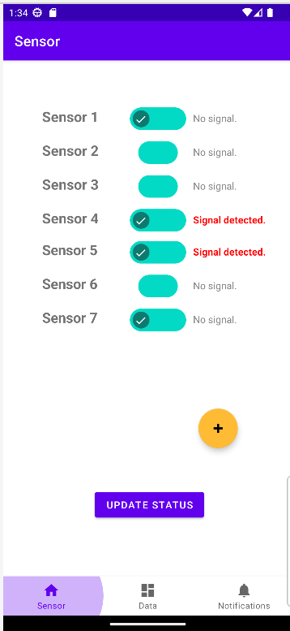
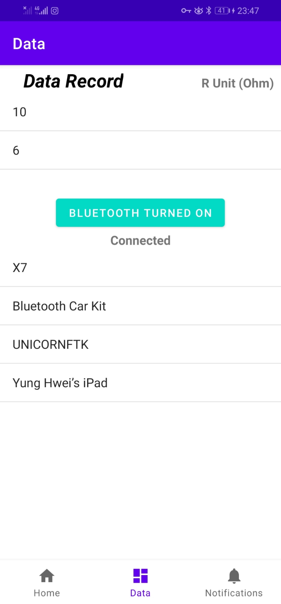

# MySensor
A simple mobile application for signal detection which get Bluetooth signals from a multimeter.

#### Progression Table

| Date        | Progress                      | Description                                                  |
| :---------: | ----------------------------- | ------------------------------------------------------------ |
| Oct 3, 2022 | Information analysis          | Analyzing requirements for sensor and functions needed by mobile application. |
| Oct 4, 2022 | Basic interface and GUI setup | Setup framework for sensor mobile application.               |
| Oct 5, 2022 | Connection between fragments  | Making a data-sharing class for connection between fragments. |
| Oct 6, 2022 | Bluetooth connection module   | Adding a Bluetooth connection between multimeter and the android phone. |
| Oct 7, 2022 | Debug                         | Debug and fix bugs in real machine.                          |
| Oct 8, 2022 | Build and release APK         | Make last adjustment and generate APK from codes.            |

#### Fragments functional overview

| Title            | Fragments                       | Description                                                  |
| :--------------: | ------------------------------- | ------------------------------------------------------------ |
| Sensor           |  | List of sensors assigned with tasks where signal detection is based on the data provided in the Data Fragment. The green chip allows the respective sensor to be switched on and off. Sensors would be doing task if it is switched on, where turns no signal when switched off or no signal detected. The yellow add button is to add sensors accordingly to the list for task executing. The purple update button is to update newest status of each sensor. |
| Data Record      |    | List of data records (Resistance, R) based on the multimeter. The Bluetooth connection module below functions to make connection between the multimeter and android phone. |
| Detection Record |  | List of detection records having the name of sensors and the time of detections. |

